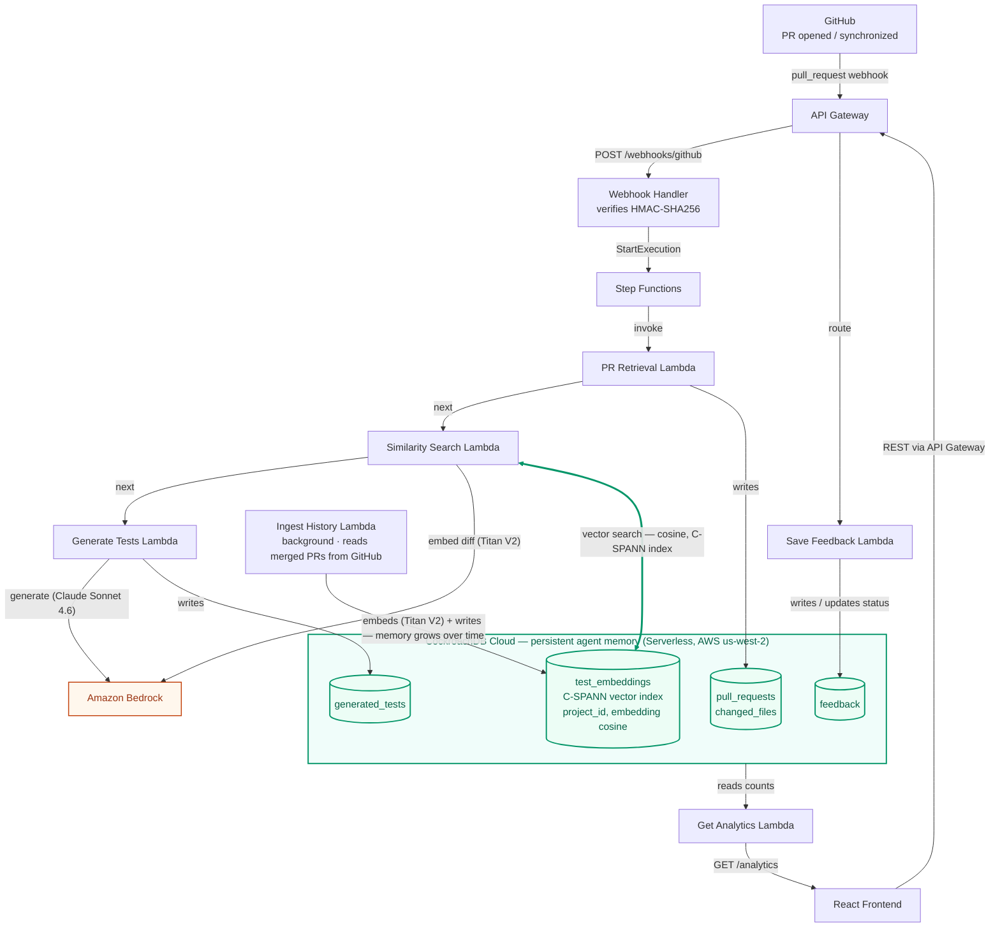

# TestSense AI

An AI-powered test generation assistant that connects to a GitHub repository, learns from its historical tests and pull requests, and automatically generates context-aware unit and integration tests for new PRs — using that repo's own conventions and edge cases as context, not generic patterns.


---

## Tech Stack

| Layer | Technology |
|---|---|
| Frontend | React 19, Tailwind CSS 4, Vite, React Router |
| Backend | AWS Lambda + API Gateway (Node.js) |
| Database | CockroachDB + pgvector (embeddings) |
| AI | Amazon Bedrock — Claude Sonnet 4.6 (test gen) + Titan V2 (embeddings) |
| Auth | GitHub OAuth, HttpOnly session cookie, AWS Secrets Manager |
| Orchestration | AWS Step Functions |

---

## CockroachDB Cloud Tools Used

This project uses two CockroachDB Cloud tools as part of the CockroachDB × AWS hackathon requirements:

1. **Distributed Vector Indexing** — `test_embeddings.embedding VECTOR(1024)` (migration [`005`](backend/db/migrations/005_create_test_embeddings.sql), dimension corrected in [`011`](backend/db/migrations/011_fix_embedding_dimension.sql)) stores one embedding per historical merged PR, generated by Amazon Titan Text Embeddings V2. A C-SPANN vector index, `idx_test_embeddings_vector` (migration [`013`](backend/db/migrations/013_add_vector_index.sql)), is built on `(project_id, embedding vector_cosine_ops)` — partitioned per project and opclass-matched to the cosine distance operator (`<=>`) the query actually uses. Confirmed via `EXPLAIN` that CockroachDB's planner selects a `vector search` scan against this index rather than a full table scan. `similarity-search` ([`backend/lambdas/memory/similarity-search/index.js`](backend/lambdas/memory/similarity-search/index.js)) embeds the incoming PR's diff and runs a distributed nearest-neighbour query against this index to retrieve the most similar past tests, which are then fed to Claude as few-shot context in test generation — this is the "memory" the agent actually acts on, not a toy query.
2. **ccloud CLI (Agent-Ready)** — used to manage and verify the `glow-croaker` Serverless cluster (region `us-west-2`, AWS) that backs the app's memory layer:
   ```
   $ ccloud cluster list
   NAME          ID                                    PLAN TYPE   STATE    CLOUD  VERSION
   glow-croaker  71353f65-57e4-4f0b-befb-9d90641060d1  SERVERLESS  CREATED  AWS    v26.2.5

   $ ccloud cluster info glow-croaker
   cluster info
    name: glow-croaker
    cockroach version: v26.2.5
    cloud: AWS
    plan type: SERVERLESS
    regions: us-west-2 (primary)

   $ ccloud cluster user list glow-croaker
   USERS
   ----
   testsense_app
   ```

---

## Architecture

CockroachDB Cloud is the single persistent store the whole pipeline reads and writes — ingestion, cosine-similarity retrieval over a real C-SPANN vector index, generation, and feedback all hit the same tables. Full walkthrough (including the end-to-end user flow) in [`docs/architecture.md`](docs/architecture.md).



---

## Quick Start

### Frontend only (mock mode — no backend needed)

```bash
npm install
cp .env.example .env        # set VITE_API_MODE=mock
npm run dev
```

App runs at `http://localhost:5173`. Sign in with the demo account to explore all pages.

### Frontend + backend (real mode)

```bash
# 1. Frontend
npm install
cp .env.example .env        # set VITE_API_MODE=real, VITE_API_BASE_URL=http://localhost:3001
npm run dev

# 2. Backend (separate terminal)
cd backend
npm install
cp .env.example .env        # fill in GitHub OAuth credentials, DATABASE_URL, secrets config
npm run dev
```

Backend runs at `http://localhost:3001`. Requires a reachable CockroachDB instance and a registered GitHub OAuth App.

---

## Folder Structure

```
src/                          # Frontend (React + Vite)
├── components/
│   ├── common/               # Button, Badge, EmptyState, LoadingState, StepIndicator, PageContainer
│   ├── layout/               # Navbar, Footer, AppLayout
│   ├── projects/             # ProjectCard
│   ├── prs/                  # SimilarExamplesPanel
│   └── repositories/         # RepositoryCard
├── data/                     # Seed data for mock mode
├── hooks/                    # useCurrentUser
├── pages/                    # One component per route
├── routes/                   # AppRoutes.jsx
├── services/                 # api.js (dispatcher), realApi.js, mockApi.js, ApiError.js
└── utils/                    # format.js

backend/
├── lambdas/
│   ├── auth/                 # github-oauth-callback
│   ├── projects/             # create, list, get, delete
│   ├── pr-ingestion/         # webhook handler, PR retrieval
│   ├── memory/               # ingest-history, similarity-search
│   ├── test-generation/      # generate-tests, submit-feedback
│   └── analytics/            # get-analytics
├── shared/                   # db-client, response helpers, middleware
├─�� db/migrations/            # SQL migrations (users, projects, memory_entries, ...)
├── step-functions/           # pipeline.asl.json
└── template.sam.yaml         # SAM / Lambda + API Gateway config

docs/                         # AUTH_FLOW.md, DATABASE.md, API.md
```

---

## API Endpoints

| Method | Path | Auth | Purpose |
|---|---|---|---|
| GET | `/auth/github/login` | — | Redirect to GitHub OAuth |
| GET | `/auth/github/callback` | — | Exchange code, issue session cookie |
| GET | `/auth/me` | ✓ | Current signed-in user |
| POST | `/auth/logout` | — | Clear session cookie |
| GET | `/repositories` | ✓ | List user's GitHub repositories |
| GET | `/projects` | ✓ | List user's projects |
| POST | `/projects` | ✓ | Connect a repository as a new project |
| GET | `/projects/:id` | ✓ | Get a project |
| PATCH | `/projects/:id` | ✓ | Update project settings |
| DELETE | `/projects/:id` | ✓ | Delete a project |
| GET | `/projects/:id/pull-requests` | ✓ | List PRs for a project |
| GET | `/projects/:id/pull-requests/:prId` | ✓ | Get a single PR |
| GET | `/projects/:id/generated-tests` | ✓ | List generated tests |
| GET | `/projects/:id/generated-tests/:testId` | ✓ | Get a single test |
| POST | `/projects/:id/generated-tests/:testId/chat` | ✓ | AI chat about a test |
| GET | `/projects/:id/analytics` | ✓ | Memory & analytics data |
| POST | `/webhooks/github` | — | GitHub pull_request webhook |

---

## Environment Variables

### Frontend (`.env`)

```
VITE_API_MODE=mock            # "mock" for demo, "real" for backend
VITE_API_BASE_URL=http://localhost:3001
```

### Backend (`backend/.env`)

```
GITHUB_CLIENT_ID=
GITHUB_CLIENT_SECRET=
GITHUB_WEBHOOK_SECRET=
DATABASE_URL=                 # CockroachDB connection string
SECRETS_PROVIDER=local        # "local" (dev) or "aws" (prod)
COOKIE_SECRET=
COOKIE_SECURE=false           # set true in production (HTTPS)
```

---

## Branch & PR Workflow

```bash
git switch main
git pull origin main
git switch -c feature/your-name-description
# ... work and commit ...
git push -u origin feature/your-name-description
```

Open a PR targeting `main`. Run checks before requesting review:

```bash
npm run lint && npm run build                              # frontend
cd backend && npm run lint && npm test && npm run build   # backend
```

One teammate review required before merging.

---

## What's Working Now

- GitHub OAuth sign-in, session management, sign-out
- Project CRUD (create, list, get, update, delete) with ownership enforcement
- Full 5-step Connect Repository flow
- PR list and detail pages (webhook status, diff viewer, changed files, similar examples)
- Generated tests page with AI chat panel (ask follow-up questions about any test)
- Memory & Analytics page (similarity scores, memory entries, retrieval stats)
- Dark UI throughout — Cursor-inspired design system
- Mock mode for fully offline frontend demos (`VITE_API_MODE=mock`)

---

## Open Tasks (Week 4)

| Issue | Assignee | Description |
|---|---|---|
| [#16](https://github.com/nguyentntram/TestSenseAI/issues/16) | Anh | Wire Bedrock (Claude Sonnet 4.6) into test generation + connect Step Functions to live DB |
| [#17](https://github.com/nguyentntram/TestSenseAI/issues/17) | Trung | Wire CockroachDB + pgvector for memory storage + Bedrock Titan V2 for embeddings |

---

## GitHub OAuth App Setup

Register at [github.com/settings/developers](https://github.com/settings/developers) → New OAuth App:

| Field | Value |
|---|---|
| Homepage URL | `http://localhost:5173` |
| Authorization callback URL | `http://localhost:3001/auth/github/callback` |

Copy the client ID and secret into `backend/.env`. Never commit them.
