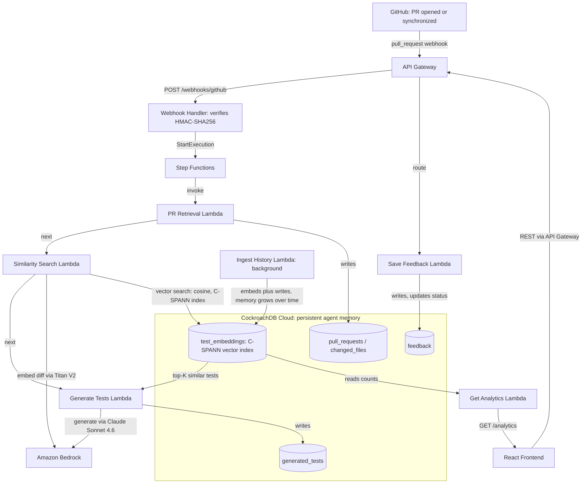

# TestSense AI — System Architecture & End-to-End User Flow

## System Architecture

One CockroachDB Cloud cluster is the single persistent store the whole agent reads and writes — ingestion, cosine-similarity retrieval over a real C-SPANN vector index, generation, and feedback all hit the same tables, with Amazon Bedrock doing the AI work in between.



No separate vector database, no cache to keep in sync — retrieval, generation, and feedback all hit this one table set. `idx_test_embeddings_vector` (migration [`013`](../backend/db/migrations/013_add_vector_index.sql)) is a real C-SPANN vector index on `(project_id, embedding vector_cosine_ops)`, confirmed via `EXPLAIN` to run as a `vector search` scan rather than a full table scan.

---

## End-to-End User Flow

```
1. CONNECT A REPOSITORY (Tram)
   ─────────────────────────────
   User clicks "Connect Repository"
     → GitHub OAuth sign-in
       → GitHub redirects to /auth/github/callback
         → Lambda exchanges code for token
           → Token stored in Secrets Manager
             → User + project records created in CockroachDB
               → Webhook registered on the GitHub repo
                 → App redirects to /projects

2. HISTORICAL MEMORY INGESTION (Trung)
   ─────────────────────────────────────
   On project connect (background):
     → Memory ingest Lambda pages through merged PRs via GitHub API
       → Each PR diff embedded via Bedrock Titan V2 (1024-dim vector)
         → Vectors stored in CockroachDB test_embeddings table
           → Project sync_status updated to "synced"

3. A PULL REQUEST ARRIVES (Han)
   ──────────────────────────────
   Developer opens/updates a PR on GitHub
     → GitHub sends pull_request webhook to API Gateway
       → Webhook handler Lambda verifies HMAC-SHA256 signature
         → PR record upserted in CockroachDB (webhook_status = "analyzing")
           → PR retrieval Lambda invoked async:
               • Fetches changed files + diffs via GitHub API
               • Stores changed_files in CockroachDB
               • Updates PR webhook_status = "analyzed"

4. TEST GENERATION (Anh + Trung)
   ──────────────────────────────
   On PR analyzed event (via Step Functions):
     → Similarity search Lambda embeds the PR diff
       → Top-5 similar historical examples retrieved from CockroachDB
         → Generation Lambda builds prompt:
             system prompt + similar examples + memory entries + PR diff
           → Claude Sonnet 4.6 on Bedrock returns JSON array of tests
             → Tests stored in generated_tests table (status = "draft")
               → PR webhook_status updated on frontend

5. DEVELOPER REVIEWS TESTS (Anh)
   ──────────────────────────────
   Developer opens PR Detail page → Generated Tests tab
     → Sees list of draft tests with "Why this test?" reasoning
       → Clicks Accept → feedback Lambda sets status = "ready"
       → Clicks Modify → edits code → feedback saved with edited_code
       → Clicks Reject → status = "rejected"
         → Acceptance rate metric updated for Trung's analytics
```

---

## Component Ownership

| Layer | Tram | Han | Trung | Anh |
|---|---|---|---|---|
| **UI pages** | Landing, Projects, Connect Repo | PR List, PR Detail | Analytics / Memory | Generated Tests, Test Detail |
| **Lambdas** | OAuth callback, Project CRUD | Webhook handler, PR retrieval | Memory ingest, Similarity search | Test generation, Feedback |
| **DB tables** | `users`, `projects` | `pull_requests`, `changed_files` | `test_embeddings` | `generated_tests`, `feedback` |
| **AWS services** | Secrets Manager (OAuth tokens) | API Gateway (webhook), Secrets Manager (webhook secret) | Bedrock (Titan V2 embeddings), IAM roles | Bedrock (Claude generation), Step Functions |

---

## AWS Services Used

| Service | Purpose |
|---|---|
| **API Gateway** | HTTP entry point for all Lambda functions |
| **Lambda (Node.js 20)** | All backend logic — one function per operation |
| **CockroachDB Cloud** | Primary database — SQL + pgvector for embeddings |
| **Amazon Bedrock** | Titan V2 (embeddings) + Claude Sonnet 4.6 (generation) |
| **AWS Secrets Manager** | OAuth tokens, webhook secrets, DB credentials |
| **Step Functions** | Orchestrates retrieval → generation pipeline |
| **IAM** | Scoped roles per Lambda — least-privilege access |
